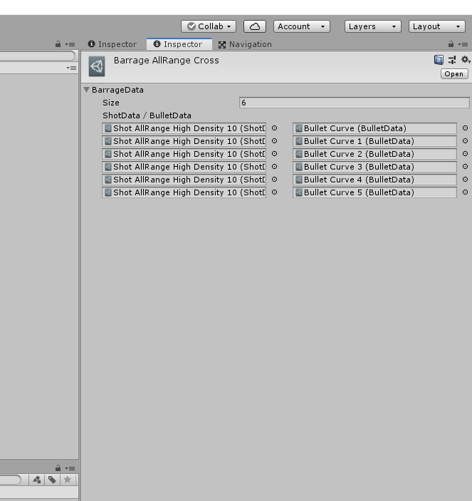

## Barrageのパラメータ
一対のBulletDataとShotDataを複数設定できる。<br>
- 同時に複数の異なる弾幕を発射出来たる
- 同じBulletDataやShotDataであれば使いまわすことが出来る.
<br>

こうしたメリットを考えてこのように設計した.

***

## パラメータ設定の例（AllRange Crossの場合）
<br>
```
上図の例では、
・6つの組み合わせを同時に発射する
・それぞれの弾の動作のみが異なり、別々の回転軸で回転する（それぞれのBullet Curveは異なるパラメータを設定してある）
```
