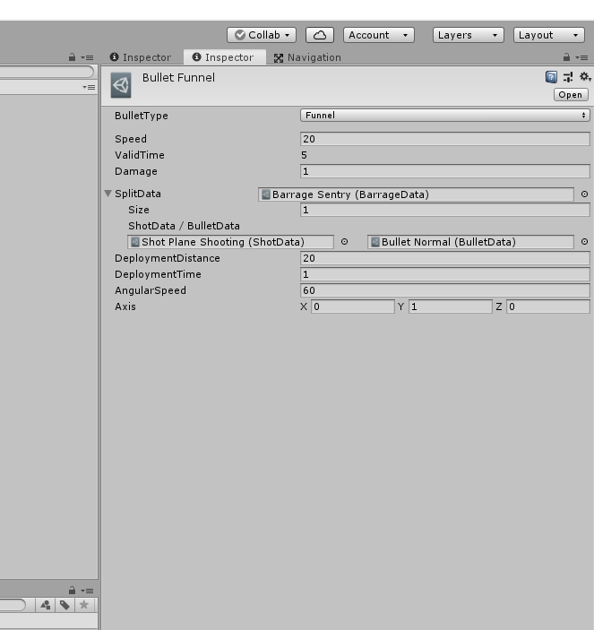

## Bulletのパラメータ
#### 標準パラメータ
- BulletType：弾の種類
  - NormalBullet：通常弾
  - CurveBullet：基準軸を中心に回転しながら進む弾
  - SplitBullet：有効時間を迎えたときに別の弾幕を発動する弾
  - ChaseBullet：追尾弾
  - FunnelBullet：基準軸を中心に一定距離で回転しながら、別の弾幕を発動する弾
- Speed：弾のスピード
- ValidTime：弾の有効時間
- Damage：弾のダメージ量

#### SplitBulelt用のパラメータ
- SplitData：弾が有効時間を迎えたときに発動する弾幕のデータ

#### CurveBullet / FunnelBullet用のパラメータ
- AngularSpeed：弾の角速度
- Axis：弾の回転する軸

#### FunnelBullet用のパラメータ
- DeploymentDistance：ファンネルが展開する距離
- DeploymentTime：ファンネルが展開するまでの時間

#### ChaseBullet用のパラメータ
- ChasePower：弾がターゲットを追尾する力
- ChaseEnableTime：弾が追尾を開始するまでの時間

***

## パラメータ設定の例（FunnelBulletの場合）
<br>
```
上図の例では、
・初速20m/s（回転による速度は考慮されていない）
・有効時間は5s（FunnelBulletの場合、この項目は放つ弾幕に依存）
・ダメージ量は1
・Barrage Sentryという弾幕を放ちながら進行
・Barrage Sentryは、「Shot Plane Shooting」と「Bullet Normal」によって構成（ここで編集可）
・展開位置は自機から半径20mの位置
・1sの時間をかけて展開位置に到達
・角速度は60deg/s（初速とは依存関係にない）
・回転軸はY軸
```
という設定をしている.<br>
