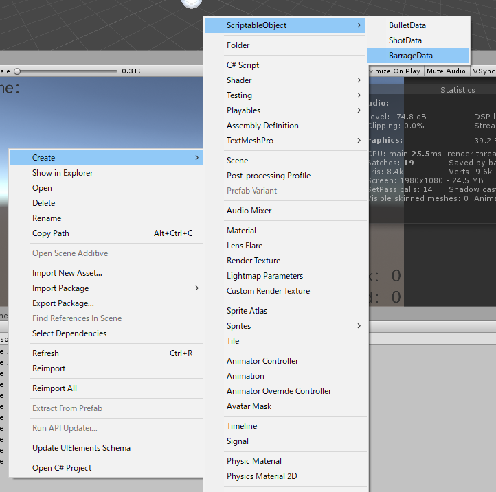
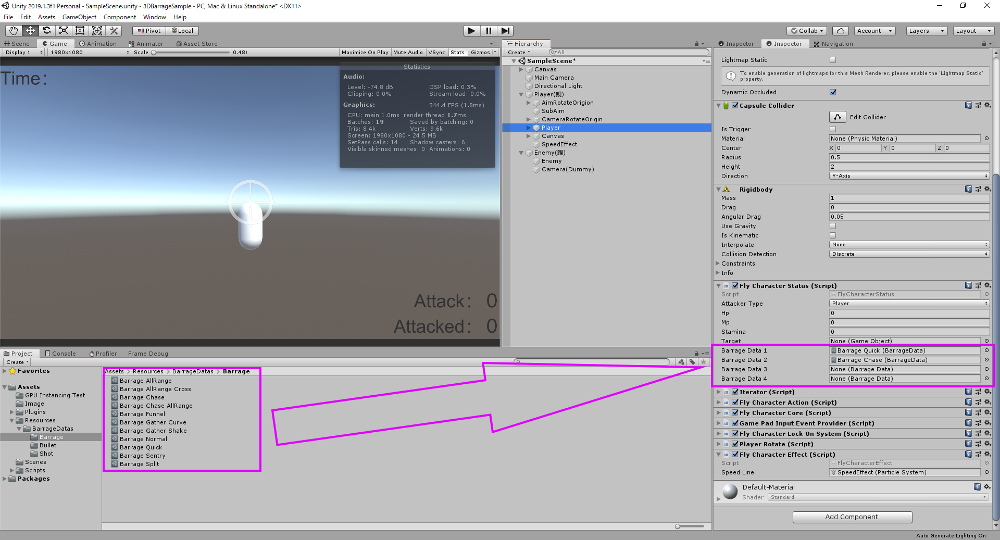

## 使い方
### 弾幕を作成する。
下図のように、ProjectのCreateの作成用メニューからそれぞれ  `BulletData`, `ShotData` , `BurrageData`を作成する. 

***
### ScriptableObjectにパラメータを設定する
作成したScriptableObjectに、 `Inspecter` 上からパラメータを設定する. 
- [BulletData](./Bullet.md)：弾に関する設定
- [ShotData](./Shot.md)：撃ち方に関する設定
- [BarrageData](./Barrage.md)：弾と撃ち方の組み合わせに関する設定  

※詳しいパラメータの説明は各種リンク先を参照

***

### 作成した弾幕のセット
Sampleでは Hierarchyの `Player(親)/Player` にアタッチされている `FlyCharacterStatus` にInspecter上からBarrageDataを設定することで、ボタンを押したときにそれが呼ばれるようになっている。
 

ちなみに、敵に対しても同様にBarrageDataを設定してあるため、変更することが可能.

***
